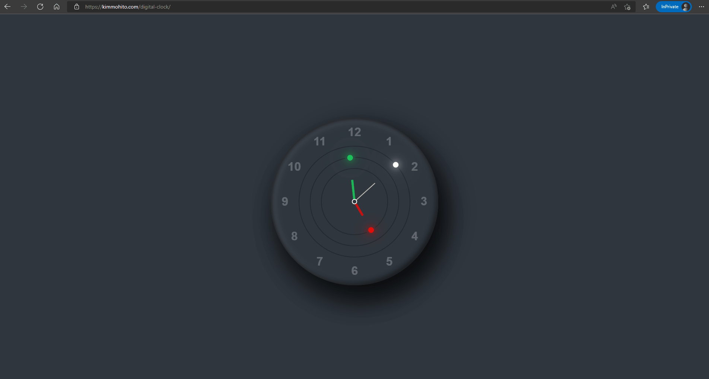

<<<<<<< HEAD
## Digital Clock

Just a fun project I create on my free time to test my understanding on `Javascript`, `CSS` elements applied in `HTML` files.

=======
<iframe src="https://www.w3schools.com" title="W3Schools Free Online Web Tutorials"></iframe>
>>>>>>> 3a9a5fa454f2251d135f700ceb852172a6e0f56c
